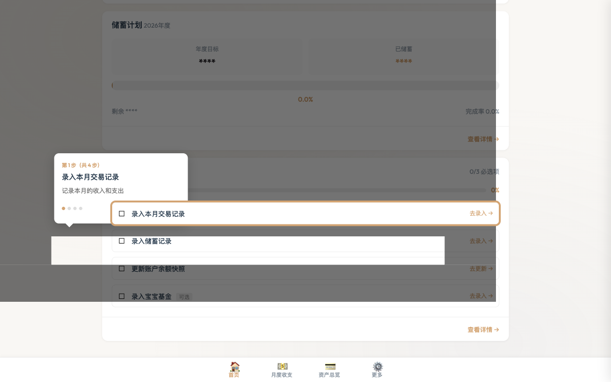
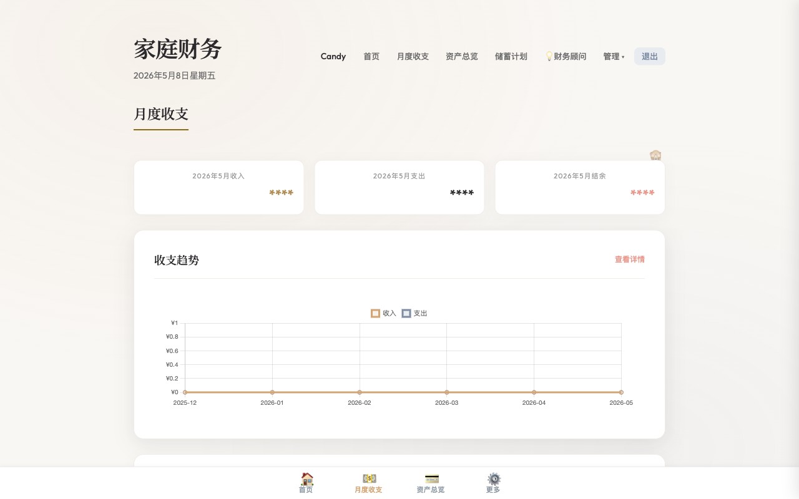
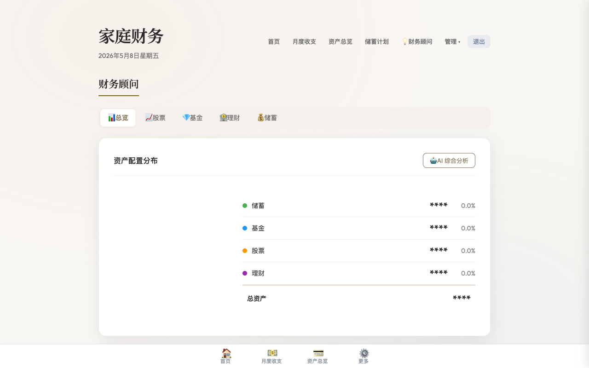

<p align="center">
  <h1 align="center">💰 家庭财务管理系统</h1>
  <p align="center">自部署、隐私优先的家庭财务管理工具<br>记账 · 资产追踪 · AI 投资分析 · 家庭协作</p>
</p>

<p align="center">
  
  
  
  
  
</p>

---

## 为什么选这个？

市面上的记账 App（随手记、MoneyForward）要么数据存在别人服务器，要么不支持投资分析，要么多人协作要收费。

这个项目解决的是：**一个小家庭想要一个自己掌控的、能看全貌的财务工具。**

| 痛点 | 解决方式 |
|------|---------|
| 💾 不想把家庭财务数据交给第三方 | 自部署到你的服务器，SQLite 本地存储 |
| 🤖 想要 AI 帮我分析投资组合 | 接入智谱 GLM 大模型，7 个维度智能分析 |
| 👨‍👩‍👧 夫妻共用一本账 | 家庭协作 + "我的/家庭"视图切换 |
| 📊 想看资产全貌（银行+基金+股票） | 三分类资产管理 + 多币种汇率换算 |
| 📱 手机也能用 | 响应式设计 + 底部 Tab + 小眼睛隐藏金额 |

> 🔒 私有部署，暂不提供公开 Demo。克隆到本地 5 分钟即可体验。

---

## 界面预览

| 首页仪表盘 | 月度收支 | 智能财务顾问 |
|:---:|:---:|:---:|
|  |  |  |

---

## 功能概览

### 📝 日常记账
手动录入 · 快捷模板一键记账 · 定期交易自动生成 · 微信/支付宝账单 CSV 批量导入 · 自定义分类

### 💳 资产管理
储蓄/基金/股票三分类 · 多币种（CNY/HKD/USD）实时汇率 · 月度余额快照 · 资产趋势图

### 🤖 智能财务顾问
持仓管理（股票/基金/理财 CRUD） · AI 分析（综合建议/个股诊断/基金评估/配置优化） · Sina 实时行情（港股/A股/美股） · App 截图 AI 识别导入持仓

### 🎯 储蓄 & 宝宝基金
月度/年度储蓄目标 + 进度追踪 · 宝宝红包/礼金记录（自动生成收入流水）

### 📊 数据报表
收支趋势折线图 · 分类构成饼图 · 资产变化曲线（储蓄/基金/股票/总资产）

### 👨‍👩‍👧 家庭协作
邀请码加入 · 多人共享账本 · "我的/家庭"一键切换 · 月度待办 Checklist

---

## 🚀 快速开始

```bash
# 克隆
git clone https://github.com/candyxiao9216/family-finance.git
cd family-finance

# 安装依赖
pip install -r requirements.txt

# （可选）配置 AI 分析
cp .env.example .env
# 编辑 .env 填入智谱开放平台 API Key

# 启动
python src/main.py
```

访问 **http://localhost:5001** → 注册 → 开始使用。

### 服务器一键部署

```bash
curl -sSL https://raw.githubusercontent.com/candyxiao9216/family-finance/main/deploy.sh \
  -o /tmp/deploy.sh && bash /tmp/deploy.sh
```

自动完成：系统依赖 → 代码克隆 → Python 虚拟环境 → Gunicorn + Nginx → 启动服务。

---

## 🛠️ 技术栈

| 层 | 技术 |
|---|---|
| 后端 | Python Flask + SQLAlchemy + SQLite |
| 前端 | 原生 CSS（变量 + 媒体查询）+ Chart.js |
| AI | 智谱 GLM（GLM-5-Turbo / GLM-5V-Turbo） |
| 行情 | Sina Finance API |
| 部署 | Gunicorn + Nginx + systemd |
| 测试 | pytest + pytest-cov（覆盖率 81%） |
| 发版 | 自动化 harness（start → release → deploy） |

---

## 📁 项目结构

```
src/
├── main.py              # 应用入口 + 仪表盘首页
├── models.py            # 数据模型（16 张表）
├── database.py          # 数据库初始化
├── routes/              # Flask 蓝图（12 个模块）
│   ├── advisor.py       #   智能财务顾问（AI + 持仓）
│   ├── transaction.py   #   月度收支
│   ├── account.py       #   资产总览
│   ├── savings.py       #   储蓄计划
│   └── ...              #   auth/category/baby_fund/upload/family/template/recurring
├── services/            # 业务服务
│   ├── ai_advisor.py    #   AI 分析引擎
│   └── market_data.py   #   行情数据
├── static/              # CSS + JS
└── templates/           # Jinja2 页面模板
```

---

## 🔧 开发工作流

```bash
./scripts/start.sh feature/xxx    # 创建功能分支
# ... 开发 & commit ...
./scripts/release.sh patch         # 发版：测试(≥80%) → squash merge → tag → CHANGELOG
./scripts/push-deploy.sh           # 部署：自动备份 → SSH 推送 → 重启 → 验证
./scripts/backup.sh                # 手动备份线上数据库到本地
```

---

## 📖 配置说明

```bash
# .env 文件
AI_API_KEY=your_zhipu_api_key       # 智谱开放平台密钥（智能顾问需要）
AI_API_URL=https://open.bigmodel.cn/api/paas/v4/chat/completions
AI_MODEL=GLM-5-Turbo
AI_VISION_MODEL=GLM-5V-Turbo
SECRET_KEY=your-secret-key           # Flask 会话密钥
FLASK_PORT=5001                      # 服务端口
```

---

## 📋 版本历史

## v2.1.0 (2026-05-12)

### 新增
- AI 文案接入智谱 GLM + 按月缓存 + 视图区分
- 记账页新增「最近常用」快捷填充 + 清理导航
- 首页仪表盘优化 — 合并顶部栏、精简资产卡片、新增快捷操作
- 数据导出+月度总结报告+家庭贡献视图+月度待办自动检测

### 优化
- 补充 v2 新功能测试 — 待办自动检测/最近常用/AI缓存/仪表盘优化

## v2.0.17 (2026-05-12)

### 新增
- 页面重做为表格+饼图，统计栏增强


## v2.0.16 (2026-05-11)

### 新增
- 转账更新余额+变更记录+删除联动+理论变化tooltip
- 转账合并显示+家庭账户分组+时间UTC+8
- 新增账号设置页面（昵称/展示图标/修改密码）
- 事件类型改为自定义输入 + 导入19条数据


## v2.0.15 (2026-05-10)

### 新增
- 新增账户间转账功能 + 对账汇总栏 + pytest数据库保护


## v2.0.14 (2026-05-10)

### 新增
- 对账助手 + 交易余额逻辑修正 + 编辑页修复


> 完整变更日志见 [CHANGELOG.md](./CHANGELOG.md)

---

## 📄 License

MIT

---

<p align="center">
  <sub>Built with ❤️ for family financial wellness</sub>
</p>
